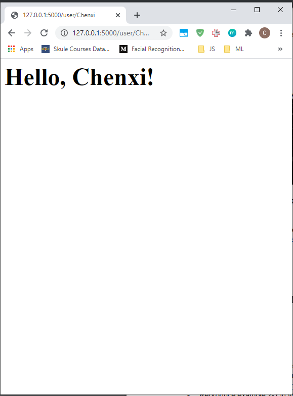

# ECE444-F2020-Lab2
Intro to flask

Chenxi Zhao 

This repo is a clone of https://github.com/miguelgrinberg/flasky

Activity 1 \

Activity 2 \

Activity 3 \

The flask context globals are: \
current_app – current application instance \
g – object for temporary storage provided to the application during request handling, this is reset with each new request \
request – request object which encapsultates the client HTTP request \
session – a dictionary for storing values between requests \
